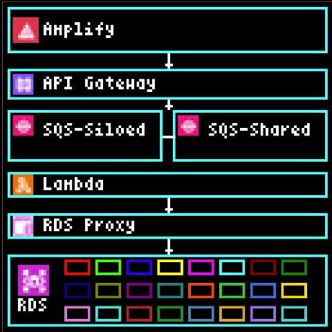
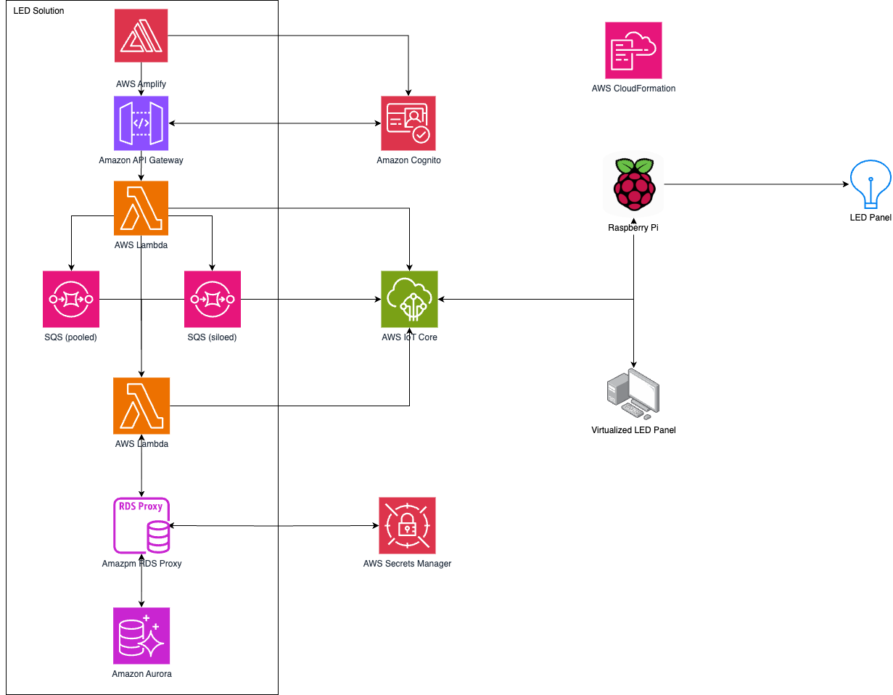
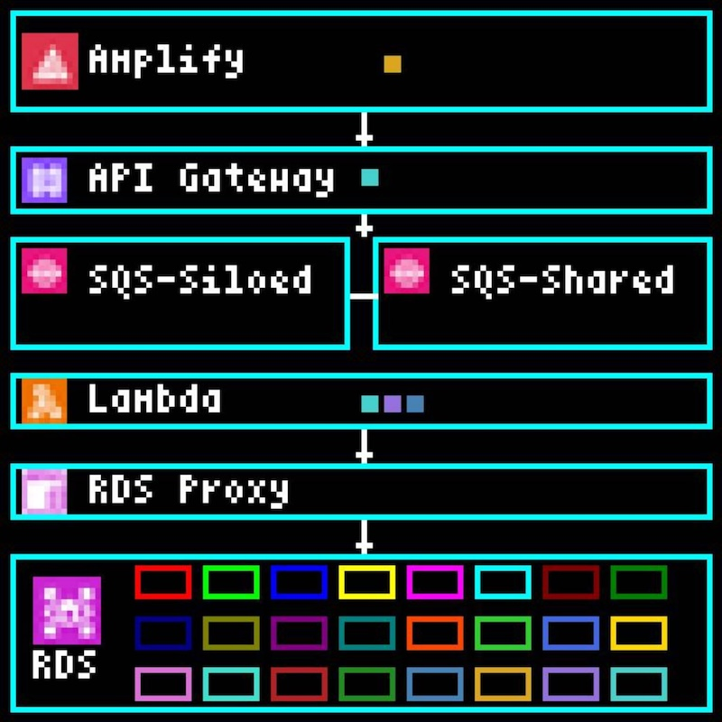
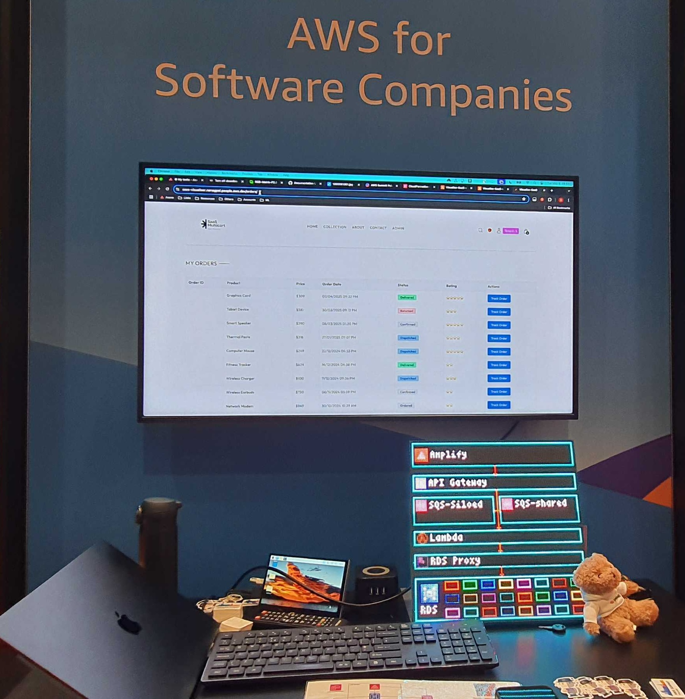

# SaaS Visualizer!

 
<em>Multi-Tenant flow with Multiple Users, Emulated LED Display (Hardware LED Display also possible)</em>

## Introduction

SaaS Visualizer is a hands-on interactive way to learn and interact with SaaS concepts. Delivered as an interactive demo in several AWS Summits in 2025, attendees interact with an on-screen UI, and below them is a physical LED array displaying a SaaS multi-tenant architecture. The architecture is completely dynamic, and whenever the user interacts with the UI, the LEDs change to show their journey through the architecture via moving LEDs. This architecture dynamically shows scaling, tenant isolation, and noisy neighbor through moving and adapting LEDs, allowing the user to learn and apply these concepts first-hand through a live dynamic scenario.

Each pixel is one LED, with each color representing a different tenant. Users can learn core multi-tenant SaaS concepts and see a dynamic architecture come to life, all while navigating an exciting SaaS application. This AWS Samples repo walks through the code and deployment steps used to build the demo and sample.

This repo includes code and deployment instructions for the complete solution: back-end, front-end, and the LED display code for Raspberry Pi. The LED display component can run in two modes:

- **Hardware mode**: Drives physical RGB LED matrix panels via Raspberry Pi GPIO
- **Emulator mode**: Software emulation for development and testing without physical hardware

Reference complete architecture:

LED display (software emulated). Note that this entire diagram has the same components as the rectangle around "LED solution" in the above diagram. Also note that this display will either be displayed on an emulator if *Emulator mode* is chosen, or on a physical set of LEDs if *Hardware mode* is chosen.

Photo at previous AWS Summit, showing UI and LED display:

## Architecture Components

- **Frontend**: React application with Vite and Tailwind CSS.
- **Backend**: AWS Lambda functions with API Gateway.
- **Database**: Aurora for tenant isolation visualization.
- **Authentication**: AWS Cognito user management.
- **Messaging**: AWS IoT Core for real-time display updates.
- **LED Display**: Python application supporting hardware and emulator modes.

## Deployment Instructions

The below sections detail the instructions to deploy this sample. Although the UI will run without the hardware, an updating architecture won't be visible, and so the following documentation steps are provided in order for those who want to deploy and run the full sample:

### Hardware for the demo (Hardware mode only)

For complete hardware setup instructions including hardware requirements and software setup, see the [Hardware Setup Guide](docs/hardware-setup.md).

### AWS Deployment

For detailed AWS deployment instructions including prerequisites, initial setup, IoT configuration, testing, and cleanup, see the [AWS Deployment Guide](docs/aws-deployment.md).

### Emulation (Emulator mode only)

For instructions on how to deploy the solution without physical hardware but instead on an emulated LED panel in your browser, see [LED Display Development](docs/development.md#3-led-display-development).

### Development

For other local development setup, configuration management, and making backend changes, see the [Development Guide](docs/development.md).

### Using the Application
Once deployment is complete and the LED display is running (emulator or hardware), see the [Usage Guide](docs/use-sample.md) for:

- How to log in with demo credentials.
- Testing the application features.
- Watching transactions flow through the architecture on the LED display.
- Understanding the multi-tenant visualization.

## Contributing

Contributions are more than welcome. We're particularly interested in contributions in the following areas:

- Frontend UI/UX improvements.
- Additional SaaS architecture patterns and visualizations.
- Performance optimizations for the LED display.
- Documentation improvements and translations.
- Bug fixes and security enhancements.

Please read the [code of conduct](CODE_OF_CONDUCT.md) and the [contributing guidelines](CONTRIBUTING.md) before submitting your contribution.

## License

This library is licensed under the MIT-0 License. See the LICENSE file. 

### 3rd Party Licensing

Please be aware of the deviating licenses of the deployed open-source software components.

- rpi-rgb-led-matrix: [GNU General Public License v2.0](https://github.com/hzeller/rpi-rgb-led-matrix/blob/ef43b877570b727d771e13f287546f12fcf2217b/COPYING)
- Please note that other deviating licenses will be included by installing the Python and npm packages used by this repo.

