# Using SaaS Visualizer

This guide shows you how to use the deployed SaaS Visualizer sample and see the architecture visualization in action.

## Prerequisites

Before using the application, ensure you have completed:

1. **AWS Deployment** - Complete the [AWS Deployment Guide](./aws-deployment.md)
2. **LED Display Setup** - Set up either:
   - **Emulator Mode** - Follow the emulator setup in the [Development Guide](./development.md#emulator-mode-local-development)
   - **Hardware Mode** - Follow the [Hardware Setup Guide](./hardware-setup.md)

The LED display (emulator or hardware) must be running and connected to AWS IoT Core before you can see the architecture visualization.

## Accessing the Application

1. Get your CloudFront distribution URL from the stack outputs:
   ```bash
   aws cloudformation describe-stacks --stack-name visualise-saas --query 'Stacks[0].Outputs[?OutputKey==`FrontendDistributionUrl`].OutputValue' --output text
   ```

2. Open the URL in your web browser:

<p align="center">
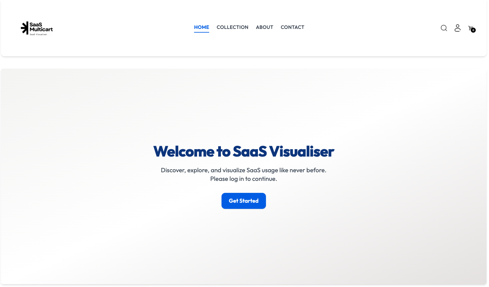
</p>

## Logging In

The application comes with 24 pre-configured demo users representing different tenants. **There is no separate admin login** - all users have equal access to the application.

### Demo User Credentials

- **Usernames**: `{username}1@{domain}` through `{username}24@{domain}`
  - Example: If you configured `CognitoUserEmailPrefix=demo+` and `CognitoUserEmailSuffix=@example.com`, the usernames are:
    - `demo+1@example.com`
    - `demo+2@example.com`
    - ... up to `demo+24@example.com`

- **Password**: All 24 users share the same password. Retrieve it from AWS Secrets Manager:
  ```bash
  aws secretsmanager get-secret-value --secret-id $(aws cloudformation describe-stacks --stack-name visualise-saas --query 'Stacks[0].Outputs[?OutputKey==`CognitoUsersPasswordSecretArn`].OutputValue' --output text) --query SecretString --output text
  ```

### Login Steps

1. Choose **Get Started** (or you'll be redirected to the login page)
2. Enter one of the demo user emails (e.g., `demo+1@example.com`)
3. Enter the password from Secrets Manager
4. Choose **Sign In**

<p align="center">
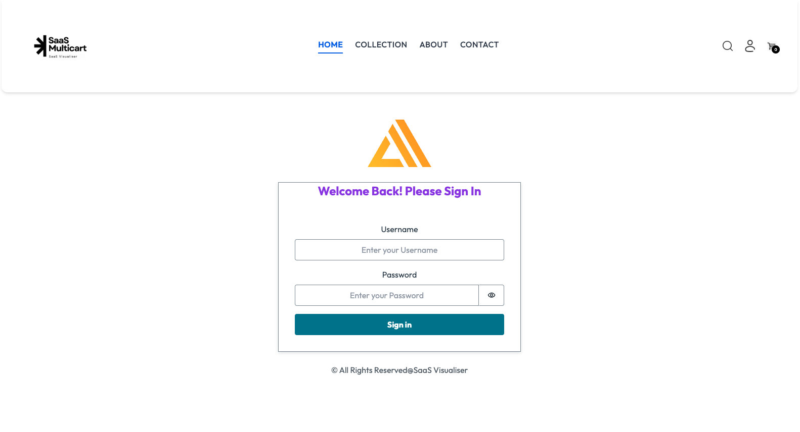
</p>

Each user represents a different tenant with a unique color assigned for visualization purposes (Tenant 1 = Red, Tenant 2 = Green, Tenant 3 = Blue, etc.). After you're logged in you'll see a page like:

<p align="center">
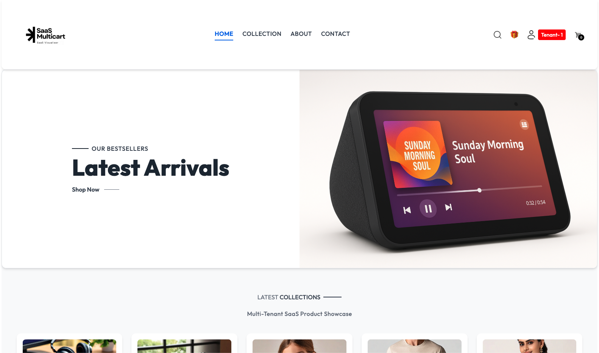
</p>

## Testing the Application

### 1. Browse Products

- Navigate to the **Collection** page to see all available products
- Each product represents a simulated SaaS offering
- All products are available to all tenants

<p align="center">
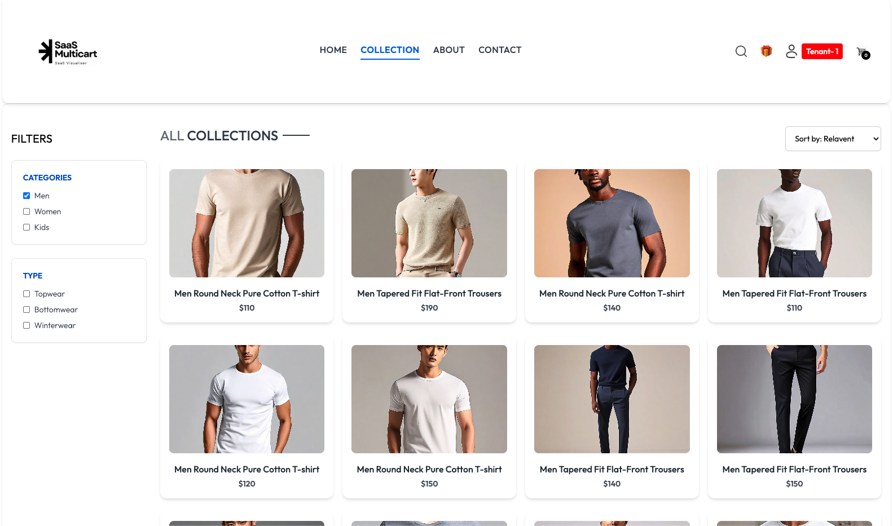
</p>

### 2. Add Items to Cart

- Choose any product to view details
- Select size and quantity
- Choose **Add to Cart**
- Items are stored in your browser's local storage (no backend call yet)

<p align="center">
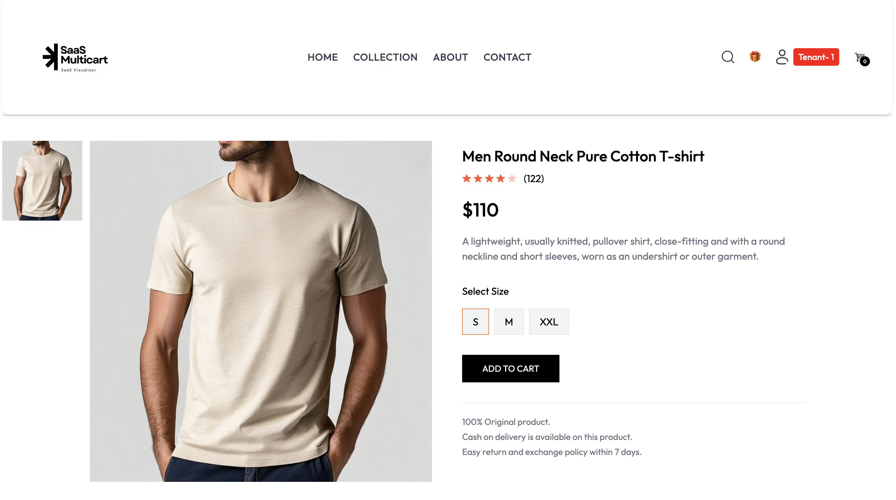
</p>

### 3. View Your Cart

- Choose the cart icon in the navigation bar
- Review items in your cart
- Update quantities or remove items
- Cart operations are client-side only at this stage

<p align="center">
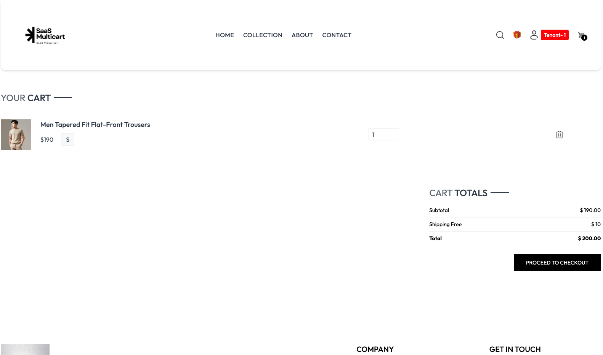
</p>

### 4. Place an Order

- In the cart, choose **Proceed to Checkout**
- Fill in fake delivery information
- Select a fake payment method
- Select a queue. This simulates whether a tenant is on a premium tier, and has access to a dedicated queue per tenant (**Siloed Queue**), or if they are on a standard tier, and share a queue between different tenants (**Shared Queue**). The latter will be cheaper for tenants, but may result in noisy-neighbor effects with other tenants and customers.
- Choose **Place Order**

<p align="center">
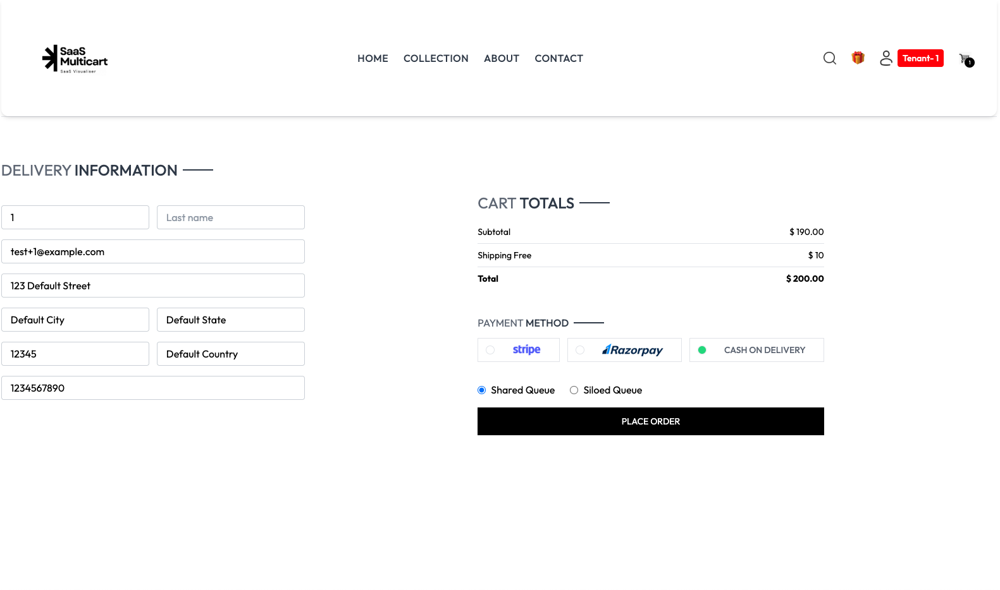
</p>

- **Now watch the LED display!** You'll see the order flow through the architecture. If you chose **Shared Queue**, you'll see the left visualization; if you chose **Siloed Queue**, you'll see the right visualization:
  1. The request starts in Amplify
  2. **API Gateway** receives the order request and writes to an SQS queue (with a Lambda function integration)
  3. **Lambda Consumer** reads from the queue and writes to RDS Proxy. If a tenant is using a **Siloed Queue**, they also have dedicated Lambda capacity to reduce latency
  4. **RDS Proxy** routes the request to the **Aurora Database** where the order is stored in the tenant's isolated schema

<p align="center">
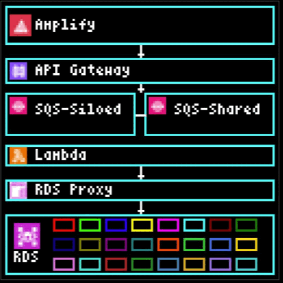
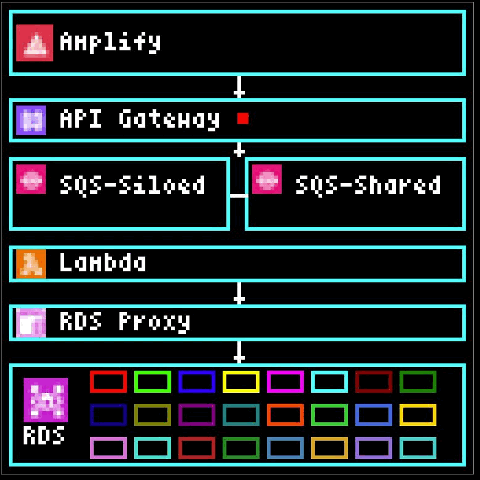
</p>

### 4a. Mystery Box Feature (Optional)

When you sign in as a new user (or after a certain amount of time), a gift icon appears in the top right of the UI. This is the "Mystery Box" feature that demonstrates automated order generation:

<p align="center">
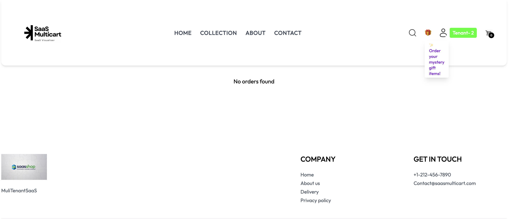
</p>

- **Choose the gift icon** to trigger the Mystery Box
- **Watch the LED display!** You'll see another transaction traverse through the architecture
- Your order history will be automatically filled with random items
- **Note:** After a certain amount of time, the order history page deliberately vanishes these mystery box orders to keep the demo clean. Other purchased items also vanish for the same reason.

This feature simulates bulk order processing and shows how the architecture handles automated transactions alongside manual user orders.

### 5. View Order History

- Navigate to **Orders** in the menu
- See your order history
- Each tenant's orders are isolated (multi-tenant architecture in action)

<p align="center">
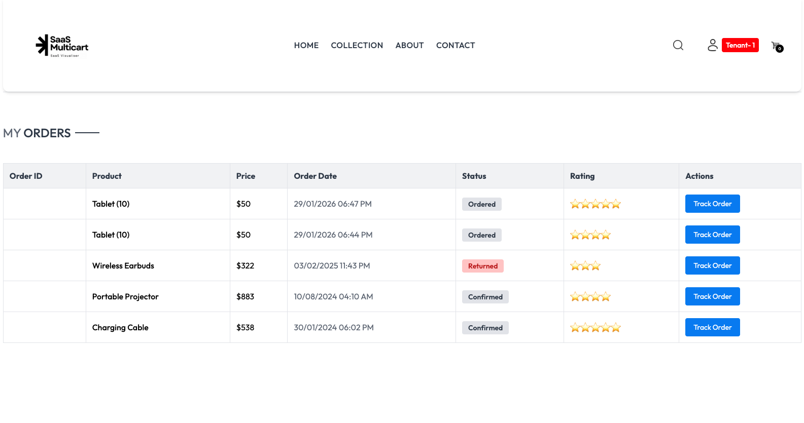
</p>

- **Watch the LED display again!** When you retrieve your order history, you'll see a different flow:
  1. The request starts in Amplify.
  1. **API Gateway** receives the GET request
  2. **Lambda** queries the database directly (no SQS queues, this is a read operation, not a write)
  3. **RDS Proxy** routes to **Aurora Database** to fetch orders from the tenant's isolated database (one database per tenant)
  4. The response flows back through Lambda and API Gateway to your browser.

<p align="center">
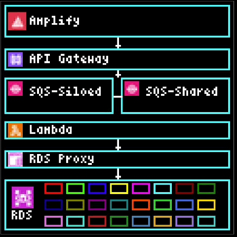
</p>

This demonstrates the difference between write operations (which use queues for asynchronous processing) and read operations (which query the database directly for immediate results).

## Testing Multi-Tenancy

### Switching Between Tenants

To easily switch between different tenants without opening multiple browser windows:

1. **Navigate to the tenant selector** by choosing your profile icon in the top right corner, then select **Select Switch**

<p align="center">
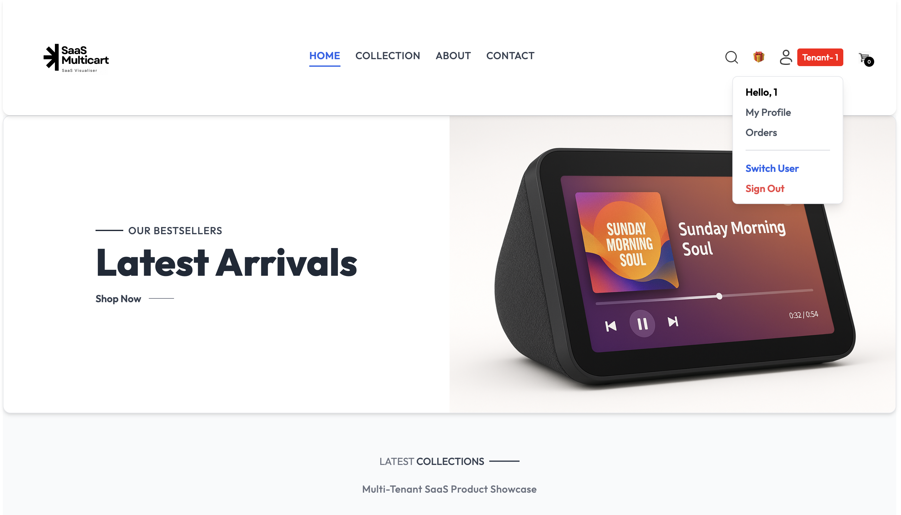
</p>

2. Choose **Select User** and **Choose a different tenant** from the list of 24 available tenants (displayed in the `username+i@example.com` format you specified in `samconfig.toml`)

<p align="center">
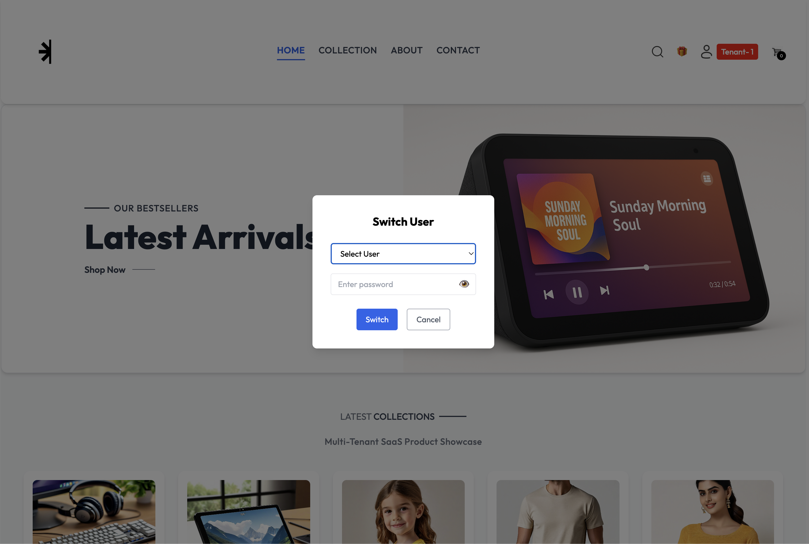
</p>

3. **Enter the password** (same password from Secrets Manager for all tenants)

4. **Notice the tenant color change** in the top right corner - each tenant has a unique color identifier

<p align="center">
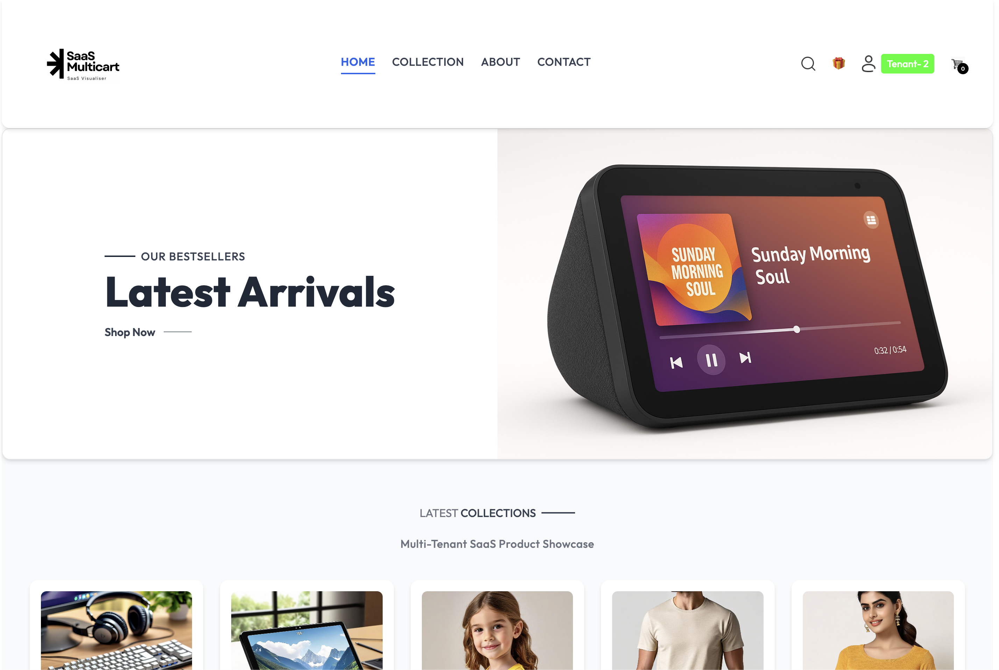
</p>

5. **Watch the LED display** - you'll see the corresponding color in the RDS section at the bottom of the LEDs, indicating this tenant's dedicated database

6. **Place an order** - when you make a purchase, only the RDS section with your tenant's color will light up, demonstrating true multi-tenancy with isolated databases per tenant

This feature showcases:
- **Tenant isolation**: Each tenant gets their own database (shown by unique colors in the RDS section)
- **Visual identification**: The color in the UI matches the color in the LED visualization
- **Data separation**: Orders from one tenant don't affect or appear in another tenant's database

### Load Generator (Optional)

If you enabled the load generator during deployment (`EnableLoadGenerator=True`), it will automatically generate simulated traffic:

- Runs on a schedule (default: every 5 minutes)
- Uses tenants 21-24 (`demo+21@example.com` through `demo+24@example.com`)
- Creates random orders to simulate realistic traffic
- Provides continuous visualization even when you're not actively using the app
- This shows a great to visualize multi-tenancy, but through resource isolation (each tenant only accesses their own database) and noisy neighbour (with enough requests, the Shared Queue will start to slow down!)

To view load generator activity:
1. Watch the LED display for automated transactions
2. Log in as tenant 21-24 to see generated orders
3. Check CloudWatch Logs for the LoadGenerator Lambda function

Depending on the number of simultaneous requests you configure, the flow may look like the below:

<p align="center">

</p>

## Troubleshooting

### Can't Log In

- Verify you're using the correct email format (including prefix and suffix)
- Ensure you retrieved the password from Secrets Manager
- Check that the Cognito User Pool was created successfully

### LED Display Not Updating

- Verify the LED display (emulator or hardware) is running
- Check that IoT certificates are properly configured
- Ensure the device is connected to AWS IoT Core (check CloudWatch Logs)
- Verify the IoT topic name matches in both the stack and device configuration

### No Products Showing

- Check that the frontend `config.js` file was properly created in S3
- Verify API Gateway URL is accessible
- Check browser console for API errors
- Ensure Lambda functions have proper permissions to access DynamoDB

### Orders Not Appearing

- Check SQS queue for messages (may indicate processing delays)
- Verify Lambda consumers are running (check CloudWatch Logs)
- Ensure RDS Proxy and Aurora database are accessible
- Check that database tables were created properly

For more detailed troubleshooting, see the [Troubleshooting Guide](./troubleshooting.md).

## Next Steps

- **Explore the Code**: See the [Development Guide](./development.md) to understand how the application works
- **Monitor with X-Ray**: Use AWS X-Ray to see detailed traces of your transactions
- **Customize**: Modify the frontend, add new features, or adjust the visualization
- **Scale Testing**: Enable the load generator and watch how the architecture handles increased load

## Clean Up

When you're finished testing, remember to clean up resources to avoid ongoing charges. See the [Clean Up section](./aws-deployment.md#clean-up) in the AWS Deployment Guide.
